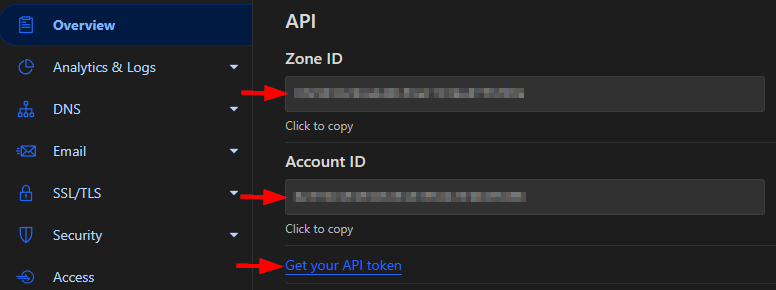
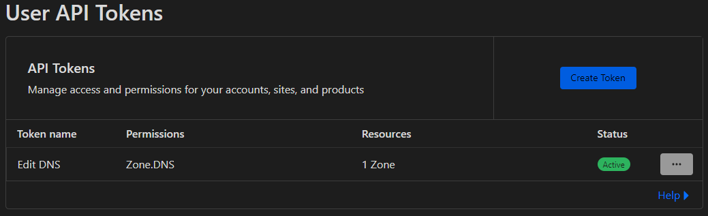

# Cloudflare DDNS

JavaScript script to get a machine's public IP and update Cloudflare DNS records using Cloudflare API. Works on anything that can run Node.js.

## Prerequisites

[Node.js](https://nodejs.org/en/download/) v16 or later

## Installation

1. Clone the repository
2. Run `npm install` to install dependencies
3. Rename `config.example.json` to `config.json`

## Configuration

1. Ger your Cloudflare **Zone ID** and **Account ID** from Cloudflare Dashboard -> Overview and set them in `config.json`.
   
2. Click on **Get your API** and create a new API Token with **Edit DNS** rights for your domain and set it in `config.json`.
   
3. Run `node getDNS.js` to get the DNS id(s). You only need to run this twice. Configure all your domains with their IDs in `config.json` `CLOUDFLARE_DNS_RECORDS` array.
4. Other settings as `proxied` or `type` are hard-coded in the `updateDNS` function but can be changed as needed. Refer to the [Cloudflare DNS API documentation](https://developers.cloudflare.com/api/operations/dns-records-for-a-zone-patch-dns-record).

## Scheduled run

### Linux

You can use a cron job to run the script at a specific interval. For example, to run the script every 10 minutes, add the following line to your crontab by running `crontab -e`:

``` bsh
*/10 * * * * cd /path/to/script/cloudflare-ddns/ && /usr/bin/node /path/to/script/cloudflare-ddns/index.js
```

### Windows

You can use Task Scheduler to run the script at a specific interval. Create a new basic task with the following settings:

Program/script: "Powershell"
Add arguments (optional): `cd "C:\path\to\script\" | node index.js`
